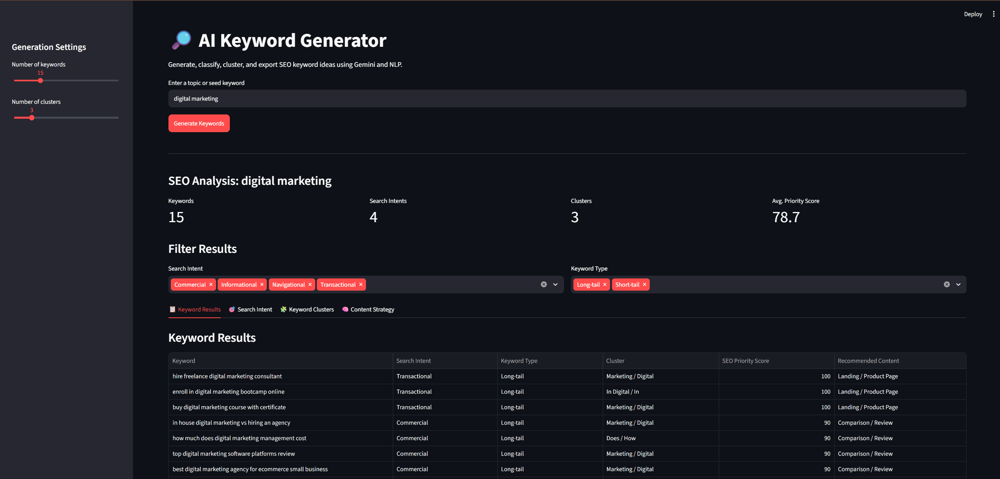
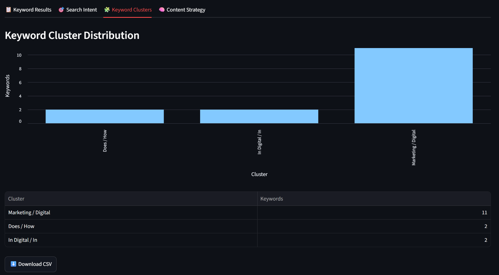
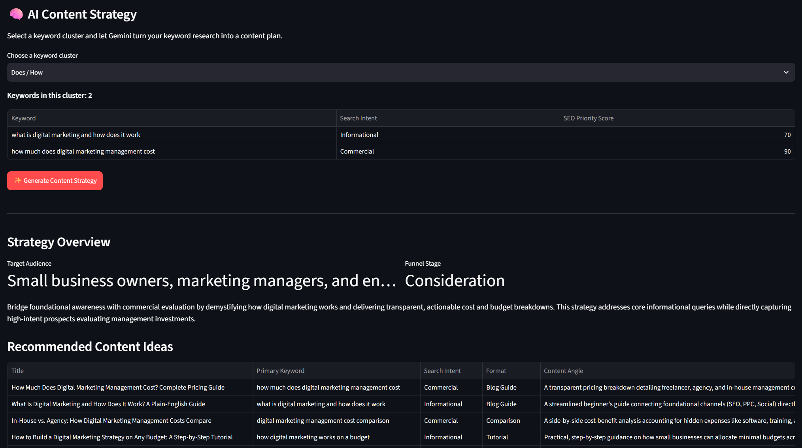

# 🔎 AI Keyword Generator

An AI-powered SEO keyword research and content strategy application built with **Python, Streamlit, Google Gemini, NLP, TF-IDF, KMeans, Pandas, Pydantic, and Pytest**.

The application converts a simple seed topic into structured SEO keyword research, automatically classifies search intent, groups related keywords using unsupervised machine learning, prioritizes opportunities, and generates an AI-assisted content strategy.

This project demonstrates how **Generative AI, NLP, machine learning, and web application development** can be combined to solve a realistic digital-marketing problem.

Rather than relying entirely on an LLM, the application combines:

```text
Generative AI
      +
Traditional NLP
      +
Machine Learning
      +
Deterministic Python Logic
      +
Interactive UI
```

This hybrid approach provides a clearer and more explainable architecture than using AI for every part of the workflow.

---

## Project Overview

Traditional keyword research often requires marketers to move between multiple tools to generate ideas, organize keywords, determine search intent, group topics, and create a content plan.

**AI Keyword Generator** combines these steps into a single workflow.

A user enters a topic such as:

```text
email marketing software
```

The application then:

1. Generates related SEO keyword ideas using Google Gemini.
2. Classifies keywords by search intent.
3. Identifies short-tail and long-tail keywords.
4. Converts keyword text into numerical vectors using TF-IDF.
5. Groups semantically related keywords using KMeans clustering.
6. Calculates a transparent heuristic SEO priority score.
7. Recommends an appropriate content type.
8. Visualizes keyword and intent distributions.
9. Generates an AI-assisted SEO content strategy for a selected cluster.
10. Exports keyword research as CSV.
11. Exports content strategies as Markdown.

---

# Features

## AI Keyword Generation

Uses the Google Gemini API to generate keyword ideas related to a user-provided seed topic.

The model is instructed to produce a mixture of:

* Broad keywords
* Long-tail keywords
* Question-based searches
* Informational searches
* Commercial searches
* Transactional searches
* Comparison searches
* Problem-focused searches

Gemini responses are returned as structured data rather than unstructured text.

---

## Search Intent Classification

Every generated keyword is assigned one of four standardized SEO search intents:

| Intent        | Meaning                                                                                 |
| ------------- | --------------------------------------------------------------------------------------- |
| Informational | User wants to learn or find information                                                 |
| Navigational  | User wants to reach a particular brand, website, product, or service                    |
| Commercial    | User is researching or comparing options                                                |
| Transactional | User is ready to perform an action such as buying, registering, booking, or subscribing |

Using predefined categories keeps the generated data consistent and easier to analyze programmatically.

---

##  Short-Tail vs Long-Tail Classification

Keywords are classified using a simple transparent rule:

* **1–3 words:** Short-tail
* **4+ words:** Long-tail

This functionality is implemented using standard Python rather than an LLM.

---

## NLP Keyword Clustering

The project combines traditional NLP and machine learning with Generative AI.

### TF-IDF

`TfidfVectorizer` transforms keyword text into numerical vectors representing important words and phrases.

### KMeans

KMeans clustering then groups similar keyword vectors into related SEO themes.

Example:

```text
digital marketing course
online marketing course
best marketing course

              ↓

        Course Cluster
```

and:

```text
digital marketing agency
marketing agency services
hire marketing agency

              ↓

        Agency Cluster
```

This is an example of **unsupervised machine learning**, because the clustering algorithm does not receive manually labelled training examples.

---

##  Interactive SEO Dashboard

The Streamlit dashboard provides:

* Keyword totals
* Number of detected search intents
* Number of keyword clusters
* Average SEO priority score
* Search-intent filters
* Keyword-type filters
* Search-intent visualization
* Keyword-cluster visualization
* Top keyword opportunities
* Interactive results tables

---

## SEO Priority Score

The application includes a simple heuristic SEO priority score.

The score is intentionally transparent and is based primarily on:

* Search intent
* Whether the keyword is long-tail

For example, commercial and transactional keywords receive higher base priority than navigational keywords.

> **Important:** The SEO Priority Score is a project heuristic. It is not a replacement for real search volume, keyword difficulty, CPC, competition, backlink, or SERP data.

The application deliberately avoids presenting AI-generated estimates as real SEO metrics.

---

##  Content Format Recommendations

Based on search intent, the application recommends an appropriate type of content.

Examples include:

| Search Intent | Suggested Content      |
| ------------- | ---------------------- |
| Informational | Blog / Guide           |
| Navigational  | Brand / Resource Page  |
| Commercial    | Comparison / Review    |
| Transactional | Landing / Product Page |

---

# AI Content Strategy Generator

After generating keyword research, users can select an individual keyword cluster and ask Gemini to create a content strategy grounded in the keywords produced by the application.

The Content Strategy module produces:

* Target audience
* Marketing funnel stage
* Strategy summary
* Five recommended content ideas
* SEO-friendly titles
* Primary keyword
* Supporting keywords
* Search intent
* Recommended content format
* Content angle
* Recommended article outline

The strategy is grounded in the selected keyword cluster rather than being generated independently.

---

## Application Workflow

```text
User enters seed topic
        │
        ▼
Google Gemini
        │
        ▼
Structured Keyword Generation
        │
        ├───────────────┐
        ▼               ▼
 Search Intent      Keyword Type
 Classification     Classification
        │               │
        └───────┬───────┘
                ▼
              TF-IDF
                │
                ▼
             KMeans
                │
                ▼
         Keyword Clusters
                │
                ▼
        Priority Scoring
                │
                ▼
       Streamlit Dashboard
                │
        ┌───────┴────────┐
        ▼                ▼
    CSV Export     Content Strategy
                         │
                         ▼
                    Google Gemini
                         │
                         ▼
                 Markdown Export
```

---

# Technology Stack

| Technology        | Purpose                                 |
| ----------------- | --------------------------------------- |
| Python            | Core application and business logic     |
| Streamlit         | Interactive web interface               |
| Google Gemini API | Keyword and content strategy generation |
| Pydantic          | Structured AI response validation       |
| Pandas            | Tabular data processing                 |
| scikit-learn      | NLP and machine learning                |
| TF-IDF            | Keyword vectorization                   |
| KMeans            | Keyword clustering                      |
| python-dotenv     | Local environment configuration         |
| Pytest            | Automated testing                       |
| Streamlit AppTest | Streamlit UI testing                    |

---

# Project Structure

```text
AI_Keyword_Generator/
│
├── app.py
├── gemini_client.py
├── keyword_generator.py
├── content_strategy.py
├── seo_utils.py
├── validators.py
├── error_handler.py
├── logger.py
│
├── tests/
│   ├── test_app.py
│   └── test_seo_utils.py
│
├── assets/
│   ├── keyword-dashboard.png
│   ├── cluster-analysis.png
│   └── content-strategy.png
│
├── pytest.ini
├── requirements.txt
├── .env.example
├── .gitignore
└── README.md
```

---

# Screenshots

## Keyword Research Dashboard



The main dashboard displays generated keywords, search intent, keyword type, NLP clusters, priority scores, and recommended content types.

---

## Search Intent & Keyword Clustering



TF-IDF and KMeans are used to organize generated keywords into related SEO topic clusters.

---

## AI Content Strategy



A selected keyword cluster can be transformed into a structured content strategy containing target audience, funnel stage, content ideas, supporting keywords, and a recommended article outline.

---

# Installation

## 1. Clone the repository

```bash
git clone <YOUR_REPOSITORY_URL>
```

Navigate into the project:

```bash
cd AI_Keyword_Generator
```

## 2. Create a virtual environment

### Windows

```powershell
python -m venv .venv
```

Activate it:

```powershell
.venv\Scripts\Activate.ps1
```

### macOS / Linux

```bash
python3 -m venv .venv
source .venv/bin/activate
```

## 3. Install dependencies

```bash
python -m pip install -r requirements.txt
```


## 4. Gemini API Configuration

Create a `.env` file in the project root.

```env
GEMINI_API_KEY=your_gemini_api_key_here
GEMINI_MODEL=your_gemini_model_here
```

Do not commit `.env` to GitHub.

The repository includes `.env.example` as a safe configuration template.


## 5. Run the Application

With the virtual environment activated:

```bash
python -m streamlit run app.py
```

Then open the local Streamlit URL shown in the terminal.

Usually:

```text
http://localhost:8501
```


## 6. Automated Testing

The project includes unit tests and Streamlit application tests.

Run the complete test suite with:

```bash
python -m pytest -v
```

The test suite includes coverage for:

* Keyword-type classification
* SEO priority scoring
* Content-format recommendation
* KMeans keyword clustering
* Streamlit application startup
* Input validation
* Mocked keyword-generation workflows

Gemini API calls are mocked during automated UI tests so that running the test suite does not consume Gemini API quota.

---

#  Exports

## CSV Export

Keyword research can be downloaded as CSV containing fields such as:

```text
Keyword
Search Intent
Keyword Type
Cluster
SEO Priority Score
Recommended Content
```

## Markdown Export

Generated content strategies can be exported as Markdown containing:

* Seed topic
* Keyword cluster
* Target audience
* Funnel stage
* Strategy summary
* Content recommendations
* Primary keywords
* Supporting keywords
* Recommended content outline


---

# Key Concepts Demonstrated

This project demonstrates practical experience with:

* Generative AI application development
* LLM API integration
* Prompt engineering
* Structured AI outputs
* Pydantic validation
* Search intent classification
* Natural Language Processing
* TF-IDF vectorization
* Unsupervised machine learning
* KMeans clustering
* Pandas data processing
* Streamlit application development
* Session-state management
* Input validation
* API error handling
* Logging
* Automated testing
* Mocking external APIs
* Secure secrets management
* CSV and Markdown generation

---

# Limitations

The application does not currently use live search-engine or commercial SEO datasets.

Therefore it does **not** claim to provide real monthly search volume, CPC, keyword difficulty, SERP ranking, backlink data, organic traffic estimates.

Keyword generation and intent classification are AI-assisted and may occasionally require human review.

The SEO Priority Score is a project-specific heuristic and should not be interpreted as an industry-standard SEO metric.

